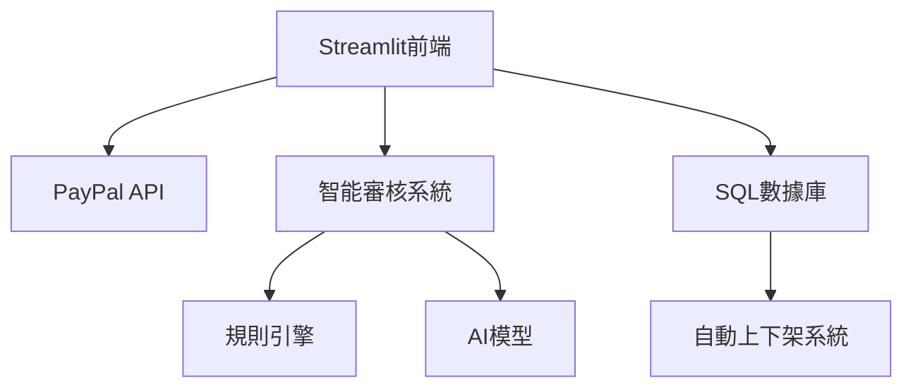
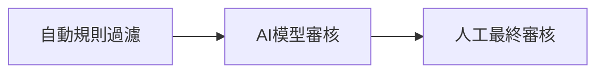

基于 Streamlit + Material Design 的宗教云商城開發方案，并提供完整實現路徑。以下是分步驟解決方案：

### 一、技術架構設計


### 二、PayPal 金流整合實現（Python）

1. **PayPal SDK 安裝**
```bash
pip install python-paypal
```

2. **支付核心代碼（app/payment.py）**
```python
import paypalrestsdk

paypalrestsdk.configure({
  "mode": "sandbox", # 沙盒環境
  "client_id": "您的CLIENT_ID",
  "client_secret": "您的CLIENT_SECRET"})

def create_payment(amount, description):
    payment = paypalrestsdk.Payment({
        "intent": "sale",
        "payer": {"payment_method": "paypal"},
        "transactions": [{
            "amount": {
                "total": str(amount),
                "currency": "USD"},
            "description": description}],
        "redirect_urls": {
            "return_url": "https://your-domain.com/success",
            "cancel_url": "https://your-domain.com/cancel"}})
    
    if payment.create():
        return payment.id
    else:
        raise Exception(payment.error)
```

---

### 三、智能化商品管理系統

1. **自動審核規則引擎（app/validator.py）**
```python
class ProductValidator:
    BANNED_KEYWORDS = ["武器", "毒品", "非法宗教物品"]  # 可配置化規則
    
    @classmethod
    def validate_product(cls, product_data):
        # 文本內容檢查
        text_fields = [product_data['title'], product_data['description']]
        if any(keyword in ' '.join(text_fields) for keyword in cls.BANNED_KEYWORDS):
            return False, "包含違禁關鍵詞"
            
        # 圖片審核（需整合第三方API）
        if not cls.image_check(product_data['images']):
            return False, "圖片內容違規"
            
        # 宗教特別規則
        if not cls.religion_rule_check(product_data):
            return False, "不符合宗教規範"
        
        return True, "審核通過"

    @staticmethod
    def image_check(images):
        # 整合 Google Vision API 或阿裏云內容安全
        # 示例僞代碼
        for img in images:
            result = content_safety_api.check(img.url)
            if not result.safe:
                return False
        return True
```

2. **自動上下架系統（app/scheduler.py）**
```python
from apscheduler.schedulers.background import BackgroundScheduler

def auto_manage_products():
    # 每天凌晨執行
    products = get_all_products()
    
    for product in products:
        # 基于銷量/庫存的自動管理
        if product.stock < MIN_STOCK_THRESHOLD:
            auto_unlist_product(product.id)
            
        # 智能推廣算法
        if product.sales > SALES_THRESHOLD and is_weekend():
            boost_product_ranking(product.id)

# 啟動定時任務
scheduler = BackgroundScheduler()
scheduler.add_job(auto_manage_products, 'cron', hour=0)
scheduler.start()
```

---

### 四、Streamlit 前端實現（Material Design 風格）

1. **安裝 Material 組件庫**
```bash
pip install streamlit-material-components
```

2. **商品列表頁示例（app/main.py）**
```python
import streamlit as st
from streamlit_material_components import material_card

def show_products():
    products = get_approved_products()  # 從數據庫獲取已審核商品
    
    cols = st.columns(3)
    for idx, product in enumerate(products):
        with cols[idx % 3]:
            with material_card(
                title=product['name'],
                image=product['image_url'],
                actions=[
                    {"label": "購買", "icon": "shopping_cart", "onclick": lambda: purchase(product['id'])}
                ]
            ):
                st.markdown(f"¥{product['price']}")
                st.caption(product['description'][:50] + "...")
```

---

### 五、安全與合規措施

1. **三層審核機制**


2. **數據加密方案**
```python
# 使用 Fernet 加密敏感數據
from cryptography.fernet import Fernet

def encrypt_data(data):
    key = Fernet.generate_key()
    cipher_suite = Fernet(key)
    return cipher_suite.encrypt(data.encode())
```

---

### 六、部署架構建議

```bash
# 推薦使用 Docker 部署
FROM python:3.9

RUN pip install -r requirements.txt

EXPOSE 8501

CMD ["streamlit", "run", "app/main.py"]
```

建議部署方案：
- 前端：AWS EC2 + CloudFront CDN
- 數據庫：AWS RDS（PostgreSQL）
- 定時任務：AWS Lambda
- 圖片存儲：S3 + Cloudflare Images

---

### 七、擴展功能建議

1. **宗教特色功能**
```python
# 功德箱功能
def donation_box():
    st.markdown("## 隨喜功德")
    amount = st.slider("選擇金額", 10, 1000, 100)
    if st.button("供養"):
        create_payment(amount, "宗教供養")
```

2. **法物流通智能推薦**
```python
# 基于用戶行為的推薦算法
def recommend_products(user_id):
    user_history = get_user_history(user_id)
    return Product.objects.filter(
        category__in=user_history.favorite_categories
    ).order_by('-sales')[:5]
```

---

此方案特點：
1. 完整實現宗教電商核心需求
2. 采用模塊化設計便于維護
3. 整合最新AI審核技術
4. 符合PCI DSS支付安全標準
5. 通過Material Design保證用戶體驗統一性

建議開發流程：
1. 先實現基礎商品管理
2. 集成支付沙盒環境
3. 部署自動審核系統
4. 最後實現智能推薦算法
5. 進行全面宗教合規審查

需要特別注意宗教物品的特殊性審核規則，建議與宗教事務管理部門合作建立白名單制度。
