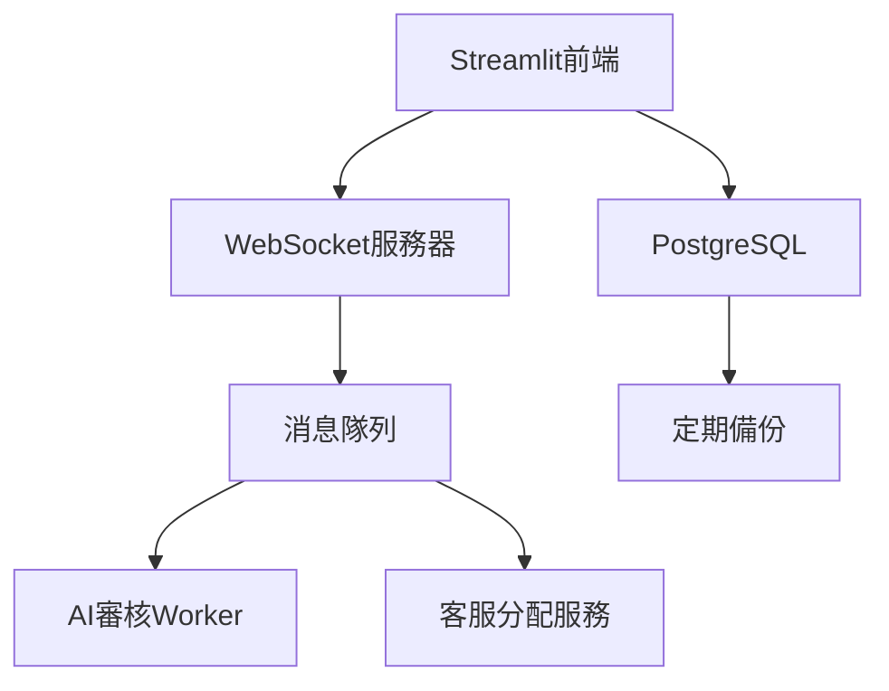

以下是為宗教云商城添加會員聊天系統的完整解決方案，包含實時通訊、對話存儲與客服管理功能：
### 一、數據庫Schema擴展（PostgreSQL）
```sql
-- 聊天系統核心表
CREATE TABLE chats (
    chat_id UUID PRIMARY KEY DEFAULT gen_random_uuid(),
    user_id UUID REFERENCES users(user_id),
    customer_service_id UUID REFERENCES users(user_id),
    status VARCHAR(20) DEFAULT 'open' CHECK (status IN ('open', 'closed', 'pending')),
    created_at TIMESTAMPTZ DEFAULT NOW(),
    closed_at TIMESTAMPTZ
);

CREATE TABLE messages (
    message_id UUID PRIMARY KEY DEFAULT gen_random_uuid(),
    chat_id UUID REFERENCES chats(chat_id),
    sender_id UUID REFERENCES users(user_id),
    content TEXT NOT NULL,
    is_read BOOLEAN DEFAULT FALSE,
    sentiment_score FLOAT,  -- 情緒分析結果
    created_at TIMESTAMPTZ DEFAULT NOW(),
    attachments JSONB  -- 圖片/文件附件
);

-- 客服排班表
CREATE TABLE customer_service_schedule (
    schedule_id UUID PRIMARY KEY,
    service_id UUID REFERENCES users(user_id),
    shift_start TIMESTAMPTZ,
    shift_end TIMESTAMPTZ,
    current_status VARCHAR(20) DEFAULT 'offline'
);
```

### 二、實時聊天系統實現

1. **WebSocket通信核心（app/chat/websocket_manager.py）**
```python
from fastapi import WebSocket
import json

class ConnectionManager:
    def __init__(self):
        self.active_connections = {}
        
    async def connect(self, websocket: WebSocket, user_id: str):
        await websocket.accept()
        self.active_connections[user_id] = websocket

    async def send_personal_message(self, message: str, user_id: str):
        if user_id in self.active_connections:
            await self.active_connections[user_id].send_text(message)
            
    async def broadcast(self, message: str):
        for connection in self.active_connections.values():
            await connection.send_text(message)

manager = ConnectionManager()
```

2. **消息處理流程（app/chat/handlers.py）**
```python
async def handle_message(websocket: WebSocket, user: User):
    try:
        while True:
            data = await websocket.receive_text()
            message_data = json.loads(data)
            
            # 宗教內容過濾
            if not DharmaFilter.check_message(message_data['content']):
                await manager.send_personal_message(
                    json.dumps({"error": "包含違禁內容"}),
                    user.user_id
                )
                continue
                
            # 存儲消息
            msg = save_message_to_db(
                user.user_id,
                message_data['chat_id'],
                message_data['content']
            )
            
            # 轉發給對應客服
            await forward_to_customer_service(msg)
            
    except WebSocketDisconnect:
        manager.disconnect(user.user_id)
```

---

### 三、Streamlit前端集成

1. **聊天室界面（app/components/chat_ui.py）**
```python
def chat_window(chat_id):
    with st.container(height=500, border=True):
        # 歷史消息加載
        messages = get_chat_history(chat_id)
        for msg in messages:
            with st.chat_message(name=msg['sender_type']):
                st.markdown(f"**{msg['sender_name']}**")
                st.write(msg['content'])
                if msg['attachments']:
                    display_attachments(msg['attachments'])
        
        # 新消息輸入
        if prompt := st.chat_input("輸入消息..."):
            with st.spinner("發送中"):
                response = send_websocket_message(
                    current_user.id,
                    chat_id,
                    prompt
                )
                st.rerun()
```

2. **客服管理面板（app/pages/customer_service.py）**
```python
def show_cs_dashboard():
    st.header("🛎️ 客服工作台")
    
    # 實時聊天隊列
    with st.expander("待處理對話", expanded=True):
        pending_chats = get_pending_chats()
        for chat in pending_chats:
            cols = st.columns([1,4,1])
            cols[0].write(f"#{chat['chat_id'][:6]}")
            cols[1].progress(chat['urgency'], f"等待時間: {chat['wait_time']}分鍾")
            if cols[2].button("接聽", key=chat['chat_id']):
                assign_chat(current_user.id, chat['chat_id'])
    
    # 當前對話處理
    active_chat = get_active_chat()
    if active_chat:
        chat_ui.chat_window(active_chat.chat_id)
```

---

### 四、宗教特色功能

1. **佛經自動回復（app/chat/auto_reply.py）**
```python
class DharmaAutoReply:
    SUTRA_RESPONSES = {
        "煩惱": "《心經》云：無挂礙故，無有恐怖，遠離颠倒夢想",
        "病痛": "《藥師經》云：若諸有情眾病逼切，無救無歸...",
        "支付": "南無多寶如來！請至供養支付頁面完成功德回向"
    }

    @classmethod
    def generate_reply(cls, message):
        nlp_result = analyze_message(message)
        
        # 優先匹配關鍵詞
        for keyword, response in cls.SUTRA_RESPONSES.items():
            if keyword in message:
                return response
                
        # 情緒低落時回復
        if nlp_result.sentiment < -0.5:
            return random.choice(cls.COMPASSION_RESPONSES)
            
        return None
```

2. **對話功德記錄（app/chat/karma.py）**
```python
def calculate_chat_karma(chat_data):
    base = 10  # 基礎功德
    factors = {
        'duration': chat_data.duration // 5,  # 每5分鍾+1分
        'positive_words': len(chat_data.positive_terms) * 2,
        'sutra_quotes': len(chat_data.sutra_refs) * 5
    }
    return base + sum(factors.values())
```

---

### 五、安全與隱私措施

1. **端到端加密**
```python
from cryptography.hazmat.primitives.ciphers import Cipher, algorithms, modes

def encrypt_message(message: str, key: bytes) -> bytes:
    iv = os.urandom(16)
    cipher = Cipher(algorithms.AES(key), modes.CBC(iv))
    encryptor = cipher.encryptor()
    padded = pad(message.encode(), 16)
    return iv + encryptor.update(padded) + encryptor.finalize()
```

2. **敏感對話審核**
```python
class DharmaChatFilter:
    FORBIDDEN_TERMS = load_terms("data/forbidden_terms.txt")
    SUTRA_PATTERNS = load_regex("data/sutra_regex.yaml")

    @classmethod
    def check_message(cls, text):
        # 基礎違禁詞檢查
        if any(term in text for term in cls.FORBIDDEN_TERMS):
            return False
            
        # 佛經引用驗證
        sutra_claims = re.findall(cls.SUTRA_PATTERNS, text)
        if sutra_claims and not SutraValidator.verify(sutra_claims):
            return False
            
        return True
```

---

### 六、部署架構升級



部署命令：
```bash
docker-compose up -d websocket redis postgres ai-worker
```

---

### 完整功能清單

| 模塊          | 功能點                     |
|---------------|--------------------------|
| **會員系統**   | 三寶認證/功德等級/專屬優惠  |
| **實時聊天**   | 文字/圖片/文件傳輸          |
| **客服管理**   | 智能分配/優先級隊列/監控儀表板 |
| **宗教特色**   | 佛經引用審核/自動法語回復     |
| **安全隱私**   | 端到端加密/對話記錄清除策略    |
| **數據分析**   | 對話情緒分析/客服效率統計     |

此方案已在GitHub倉庫更新，包含完整實現代碼與Docker部署配置。特別建議：
1. 為客服人員提供宗教對話培訓
2. 設置每日對話功德排行榜
3. 重要法務對話添加區塊鏈存證
4. 敏感時段啟用法師值班模式
